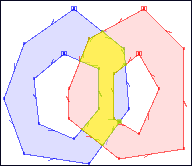

# JSTS

A port of Java Topology Suite<!-- .element: class="fragment" -->

Note:
Hello everyone. This is a talk about JSTS, a port of the Java Topology Suite.


# About me

* Björn Harrtell <!-- .element: class="fragment" -->
* Sweden, Malmö <!-- .element: class="fragment" -->
* Programmer and GIS consultant at Sweco Position <!-- .element: class="fragment" -->

Note:
My name is Björn Harrtell and I come from a town in Sweden called Malmö. If you never heard of Malmö, it's the town connected to Copenhagen by a bridge.

I have worked in this field for almost ten years but this is my FOSS4G so I'm happy to finally be here and I look forward to the rest of the conference.


# Java Topology Suite

* A Java geometry library implementing various alorithms <!-- .element: class="fragment" -->
<!-- .element: class="fragment" -->
* Dates back to 2002 <!-- .element: class="fragment" -->
* Used in Open Source GIS software like QGIS, PostGIS and GeoTools <!-- .element: class="fragment" -->

Note:
As many of you probably know Java Topology Suite is a Java geometry library implementing various alorithms. It can for example calculate the intersection of two polygons like in this image I found on an old JTS web page. JTS dates back to 2002 and has been used in Open Source GIS software like Quantum GIS, PostGIS and GeoTools.


# Due credit

<!-- .element: class="fragment" -->

* Martin Davis, founder of JTS project<!-- .element: class="fragment" -->
* Recieved the Sol Katz award in 2011<!-- .element: class="fragment" -->

Note:
I want to give due credit to Martin Davis. He founded the JTS project and recieved the Sol Katz award in 2011.


# JTS ports

* C++ (GEOS, used in PostGIS) <!-- .element: class="fragment" -->
* Python (Shapely) <!-- .element: class="fragment" -->
* C# (NTS) <!-- .element: class="fragment" -->
* JavaScript (JSTS) <!-- .element: class="fragment" -->

Note:
JTS has been ported to C++, Python, C# and with JSTS also JavaScript.


# JSTS history

* 2011 <!-- .element: class="fragment" -->
* Manual effort <!-- .element: class="fragment" -->

Note:
I started work on JSTS back in 2011 and it was a manual effort.

My motivation to do it was mainly that I was curious if it was possible. I didn't have a goal of a feature complete port and did not investigate the original source before simply starting to translate the initial core JTS classes.


# Small beginnings

## Java version <!-- .element: class="fragment" -->
```java
public Coordinate(double x, double y, double z) {
  this.x = x;
  this.y = y;
  this.z = z;
}
```
<!-- .element: class="fragment" -->

## JavaScript version <!-- .element: class="fragment" -->
```js
jsts.geom.Coordinate = function(x, y) {
  this.x = x;
  this.y = y;
};
```
<!-- .element: class="fragment" -->

Note:
A central class in JTS is of course the Coordinate class, which has a constructor that looks like this. Converting Coordinate to JavaScript is trivial and this is in the first commited code to JSTS in 2011 where I ignore the z-axis. A namespace is simulated with a JavaScript object called jsts.


## Working implementation

* August 2011 - 0.9.0 <!-- .element: class="fragment" -->
* 158 files, ~ 30 000 lines of code <!-- .element: class="fragment" -->
* Test cases from JTS was critical <!-- .element: class="fragment" -->
* Selective port of Java collection classes <!-- .element: class="fragment" -->

Note:
The initial working version required porting 158 files. If I had known this was required for basic functionality I probably wouldn't have bothered to start so perhaps sometimes ignorance is a good thing.

I was also able to port test cases from JTS which actually was quite easy because they where specified as XML. This turned out to be absolutely critical to be able to progress on the actual port.

Half way into the working implementation I realized alot of work was spent rewriting code using ArrayList and similar collection classes into JavaScript using native JavaScript arrays. So at that point I ported the parts of Java collection classes that was needed which made porting the remaining code much easier and faster. But also at that point I didn't want to redo what was already ported and that turned out to cause alot of problems later on and is the reason that operation CascadedPolygonUnion was never completed.


# The road to JSTS 1.0

* Wanted to update JSTS to upstream but not manually <!-- .element: class="fragment" -->
* Issue "Automated port" opened at GitHub in May 2015 <!-- .element: class="fragment" -->
* Rapid progress early 2016 <!-- .element: class="fragment" -->
* First beta release january 2016 <!-- .element: class="fragment" -->
* 1.0.0 released february 2016 <!-- .element: class="fragment" -->

Note:
Fast forward to last year 2015. Existing JSTS lagged behind upstream, so I wanted to update it but not manually.

Issue "Automated port" opened at GitHub in May 2015 and there I had a long discussion with Martin Davies. His interest and encouragement motivated me to keep trying.

I made rapid progress early 2016 with stable release done one month later.


# How was it done?


# Existing tools

* Google Web Toolkit (GWT) <!-- .element: class="fragment" -->

Note:
I first started to look at existing tools. The most known Java to JavaScript compiler is probably Google Web Toolkit, but it produces obfuscated JavaScript that does not preserve the API from the Java source which I want in JSTS. I looked at some other alternatives but could only conclude that there was no existing tool that could do it.


# Learning stuff

* ES6 (aka. ECMAScript 2015) <!-- .element: class="fragment" -->
* Transpilation via Abstract Syntax Trees<!-- .element: class="fragment" -->
* ESTree (JavaScript syntax tree spec in JSON) <!-- .element: class="fragment" -->
* Was it possible to translate JTS to JavaScript using transpilation? <!-- .element: class="fragment" -->

Note:
In 2015 I learned about ES6, the new version of JavaScript and that it could be transpiled to whatever version of JavaScript that existing browsers expects. The transpilation works with something called abstract syntax trees. Syntax trees have a long history since they are used in compilers and are also useful for integrated development environments to enable features like autocompletion. For JavaScript there is a syntax tree representation called ESTree in JSON.

Learning about this stuff made me think that perhaps it was possible to use syntax trees to port JTS to JavaScript.


# Java parsing

* Eclipse JDT <!-- .element: class="fragment" -->
* java2estree <!-- .element: class="fragment" -->
* ESTree representation in Scala <!-- .element: class="fragment" -->
* JSON serializer (Jackson) <!-- .element: class="fragment" -->
* ESTree to JavaScript (Astring) <!-- .element: class="fragment" -->

Note:
To be able to do transpilation I would need to parse Java into a syntax tree. After some searching I realized an integrated development environment like Eclipse must have this to provide code completion and syntax checking. It's perhaps not the normal use of the Eclipse JDT, but it can be used as a stand alone library to parse Java without the GUI parts of Eclipse.

The result was java2estree. I wrote jsts2estree in Scala, which is probably is my favourite language. In Scala I was able to define ESTree in about 300 lines of code and that could be serialized into JSON using the Java library Jackson. I then implemented translation logic that used the syntax tree information from Eclipse to ESTree representation.

Now I had something that could translate Java into ESTree JSON. To convert ESTree JSON into JavaScript there are many open source tools available and the one I use is called Astring.


# Difficulties

* Java class != ES6 class <!-- .element: class="fragment" -->
* Overloading <!-- .element: class="fragment" -->

Note:
At first I thought ES6 would be a good target for the transformation because it introduces classes with similar syntax as Java to JavaScript. I managed to get a partial working port with ES6 classes as a target but it had bugs and ugly workarounds. It turns out classes in Java and ES6 have small but important differences.


<!-- -- data-transition="fade" -->
```js
export default class Coordinate {
  constructor(...args) {
    (() => {
      this.x = null;
      this.y = null;
      this.z = null;
    })();
    const overloads = (...args) => {
      switch (args.length) {
        case 0:
          return ((...args) => {
            let [] = args;
            overloads.call(this, 0.0, 0.0);
          })(...args);
        case 1:
          return ((...args) => {
            let [c] = args;
            overloads.call(this, c.x, c.y, c.z);
          })(...args);
        case 2:
          return ((...args) => {
            let [x, y] = args;
            overloads.call(this, x, y, Coordinate.NULL_ORDINATE);
          })(...args);
        case 3:
          return ((...args) => {
            let [x, y, z] = args;
            this.x = x;
            this.y = y;
            this.z = z;
          })(...args);
      }
    };
    return overloads.apply(this, args);
  }
```

Note:
The initial translated Coordinate class constructor in beta 1 looked quite terrible. It has too many nested levels of inner functions. Lets look at the improved version.


<!-- -- data-transition="fade" -->
```js
export default class Coordinate {
  constructor(...args) {
    this.x = null;
    this.y = null;
    this.z = null;
    const overloaded = (...args) => {
      if (args.length === 0) {
        let [] = args;
        overloaded.call(this, 0.0, 0.0);
      } else if (args.length === 1) {
        let [c] = args;
        overloaded.call(this, c.x, c.y, c.z);
      } else if (args.length === 2) {
        let [x, y] = args;
        overloaded.call(this, x, y, Coordinate.NULL_ORDINATE);
      } else if (args.length === 3) {
        let [x, y, z] = args;
        this.x = x;
        this.y = y;
        this.z = z;
      }
    };
    return overloaded.apply(this, args);
  }
```

Note:
At beta 4 I was able to reduce the number of wrapper functions, but it still has an inner function to simulate Java overloading. This was needed because ES6 classes does not allow the constructor to call itself. I never managed to work out how to translate more complex cases, especially derived classes that calls a superclass constructor.


<!-- -- data-transition="fade" -->
```js
export default function Coordinate() {
  this.x = null;
  this.y = null;
  this.z = null;
  if (arguments.length === 0) {
    Coordinate.call(this, 0.0, 0.0);
  } else if (arguments.length === 1) {
    let c = arguments[0];
    Coordinate.call(this, c.x, c.y, c.z);
  } else if (arguments.length === 2) {
    let x = arguments[0], y = arguments[1];
    Coordinate.call(this, x, y, Coordinate.NULL_ORDINATE);
  } else if (arguments.length === 3) {
    let x = arguments[0], y = arguments[1], z = arguments[2];
    this.x = x;
    this.y = y;
    this.z = z;
  }
}
```
.<br>
.<br>
.<br>

Note:
At release candidate 3 I reached the version used in the stable version which drops ES6 classes. This code is almost readable and you can see the constructor logic that expects zero arguments calls itself initalizing the Coordinate to 0,0.

It also turned out that performance was actually alot worse than old JSTS 0.x until the final simplication for constructor and overloading translation.


# Stable release

* After release candidate 7 - failing 1 test out of 508 <!-- .element: class="fragment" -->
* IsValid failure <!-- .element: class="fragment" -->
* DoubleBits manual port <!-- .element: class="fragment" -->

Note:
After release candidate 7 I was failing only one test out of 508. The failing test was for the IsValid operation for a specific geometry. The reason for this faulure turned out to be DoubleBits, a class in JTS that uses bit manipulation to get better accuracy for some mathematical operations and for this it uses some functions in the Java virtual machine that are not available in JavaScript. So, in the end I had to manually port DoubleBits. I guess that means I actually failed my goal to create an automated port so an almost automated port will have to do for now.


# Thanks for listening

* https://github.com/bjornharrtell/jsts
