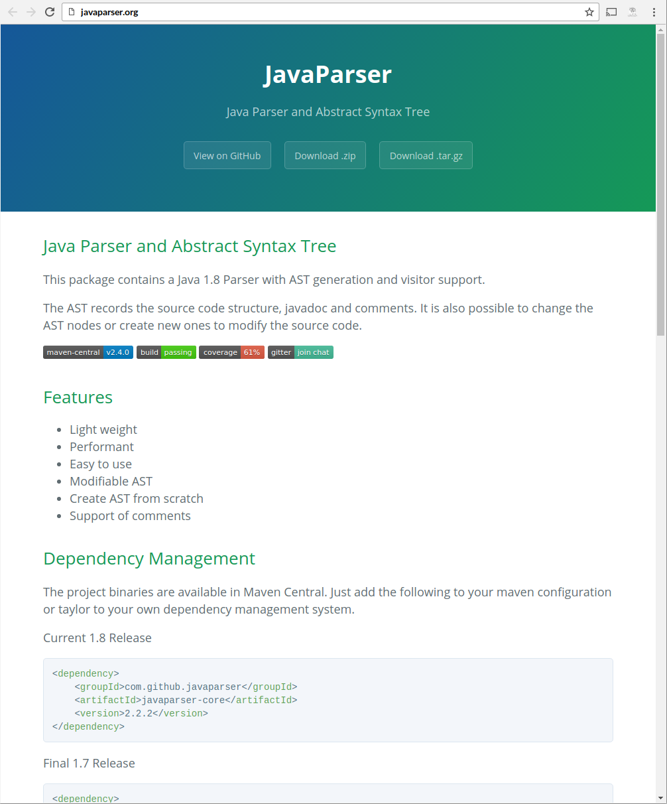

# JSTS

A port of Java Topology Suite<!-- .element: class="fragment" -->


# Quick orientation


# Java Topology Suite

* A Java library of spatial predicates and operations <!-- .element: class="fragment" -->
<!-- .element: class="fragment" -->
* Dates back to 2002 <!-- .element: class="fragment" -->
* Used in one or another way in prominent Open Source GIS software like QGIS, PostGIS and GeoTools <!-- .element: class="fragment" -->

Note:
Based on


# Due credit

<!-- .element: class="fragment" -->

* Founder of JTS project<!-- .element: class="fragment" -->
* Recieved the Sol Katz award in 2011<!-- .element: class="fragment" -->

Note:
This guy is Martin Davis. He founded the JTS project and recieved the Sol Katz award in 2011 for his contributions.


# JTS ports

* C++ (GEOS, used in PostGIS) <!-- .element: class="fragment" -->
* Python (Shapely) <!-- .element: class="fragment" -->
* C# (NTS) <!-- .element: class="fragment" -->
* JavaScript (JSTS) <!-- .element: class="fragment" -->


# JSTS 0.x

* 2011 <!-- .element: class="fragment" -->
* Manual effort <!-- .element: class="fragment" -->

Note:
So, I started work on JSTS back in 2011. My motivation to do it was firstly that I was curious if it was at all possible and secondly I was in need of a programming hobby that did not require alot of thought (or so I thought). My approach was naive and I did not investigate the architecture of JTS at all before simply starting to manually translate the initial classes.


# Small beginnings

## JTS version <!-- .element: class="fragment" -->
```java
public Coordinate(double x, double y, double z) {
  this.x = x;
  this.y = y;
  this.z = z;
}
```
<!-- .element: class="fragment" -->

## JSTS version <!-- .element: class="fragment" -->
```js
jsts.geom.Coordinate = function(x, y) {
  this.x = x;
  this.y = y;
};
```
<!-- .element: class="fragment" -->

Note:
A central class in JTS is of course the Coordinate class, which has a constructor that looks like this. Converting to JavaScript is trivial and this is in the first commited code to JSTS where I ignore the z-axis. A namespace is simulated with a JavaScript object called jsts.


## Working implementation

* August 2011 <!-- .element: class="fragment" -->
* 200 files, x lines of code <!-- .element: class="fragment" -->
* Selective port of Java collection classes <!-- .element: class="fragment" -->

Note:
The initial working version of JSTS, 0.9.0, required porting almost 200 files. Had I known this was required for basic functionality at the start I probably would have given up.

Some ways into the project I realized that porting Java code using collection classes like ArrayList required alot of work and that the process could be simplified by simply porting ArrayList first. Unfortunately this meant that some initially ported code used a native JavaScript array as input/output instead of an instance of an ArrayList which caused alot of problems later on and is the reason a port of CascadedPolygonUnion was never completed.


# JSTS 1.0

* Wanted to update JSTS to upstream but not manually <!-- .element: class="fragment" -->
* Issue opened at GitHub in may 2015 discussion with dr-jts followed <!-- .element: class="fragment" -->
* First beta release january 2016 <!-- .element: class="fragment" -->
* 1.0.0 released february 2016 <!-- .element: class="fragment" -->

Note:
I was motivated alot by Martins interest and encouragement so I really want to thank him for that.


# Existing tools

* GWT <!-- .element: class="fragment" -->
* Eclipse VJET <!-- .element: class="fragment" -->

Note:
GWT lacks... VJET seemed promising but activity stopped in early incubation process


# Learning stuff

* ECMAScript 2015 <!-- .element: class="fragment" -->
* ESTree (AST) <!-- .element: class="fragment" -->
* Beginning to think AST to AST transformation is possible <!-- .element: class="fragment" -->

Note:
Add explanation of ESTree


# Java AST

* Javaparser https://github.com/javaparser/javaparser <!-- .element: class="fragment" -->
* Missing type bindings analysis
* Eclipse JDT
* java2estree
 * estree representation in Java
 * JSON serializer (Jackson)


# Javaparser




# TODO

* java2estree
* Emulating java.* stuff
* Overloading...
* Class woes
* Floating point woes (DD)
